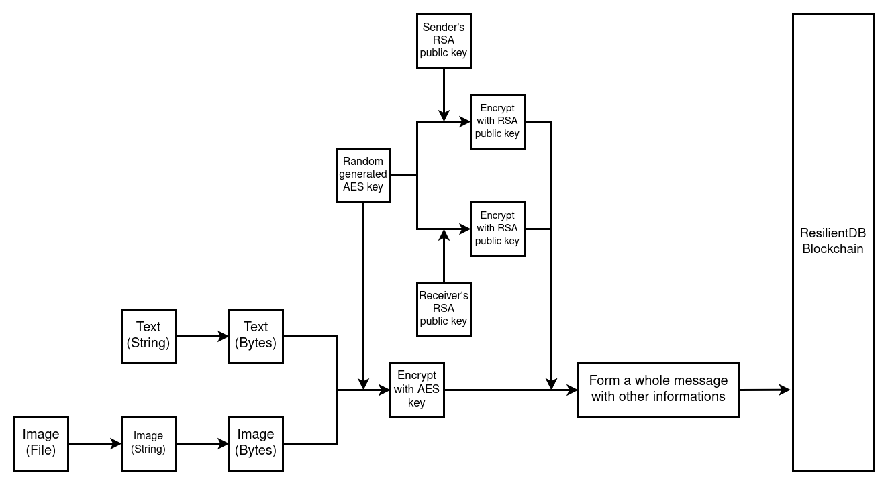

# ResChat
A Decentralized chat system based on ResilientDB

Jiazhi(Kenny) Sun

## 1. Project Description
### 1.1 Overview
In today's life, when we try to send a message on most chat software, the message will first be sent to the central server, 
and then forwarded to the target user by the central server. 
The disadvantage of this is that all data will be captured and stored by the central server, 
which greatly increases the risk of data leakage and leakage of private information. 
Now, we will create a decentralized chat system based on the ResilientDB blockchain. 
This decentralized chat system does not store any personal information, 
and only the sender and recipient can encrypt and decrypt the message during the transmission of the message.

### 1.2 Key Features
1. Decentralized Architecture: Our system avoids the need for a central server. All messages are transmitted through ResilientDB blockchain.
2. Security: By using the combined encryption algorithm(RSA + AES), we can ensure that information cannot be easily cracked during blockchain transmission. Only the sender and recipient of the message can use their keys to encrypt and decrypt
3. Privacy-first Approach: User data is never stored on any central server. No chat history will be stored.
4. Open-source: To ensure utmost transparency and security, our system is fully open-source, allowing community participation and review.
5. Flexibility: Users can create their own ResilientDB blockchain and use ResChat as an intranet chatting software, or users can connect to the main blockchain and use ResChat as a internet chatting software.
6. Extremely low disk space usage: Users only need to store their private key locally, and everything else is stored in the blockchain.

## 2. Overall Idea
### 2.1 Security(Encryption)
This project uses RSA + AES as the encryption algorithm. The message will be first encrypted by a randomly generated 16 bytes(128 bits) AES key. 
Then, this AES key will be encrypted by 2048 bits RSA public key(AES key will be encrypted twice, one with sender's public key, another with receiver's public key).
In this approach, ResChat can achieve not only secure text messages transfer but also secure file transfer(RSA can not encrypt a string that is too long).

